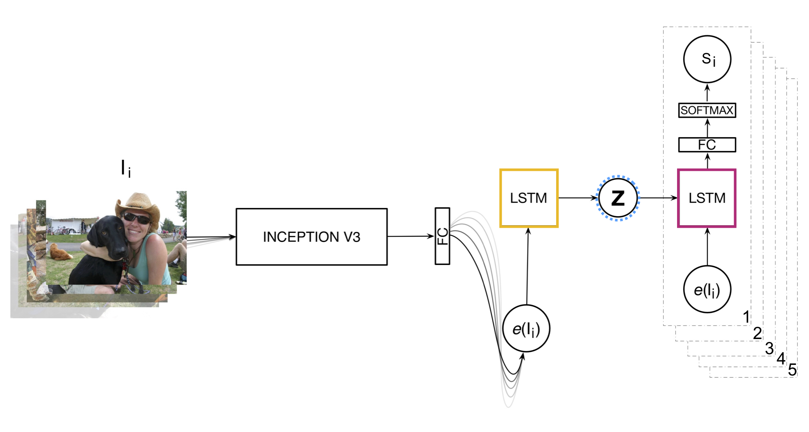
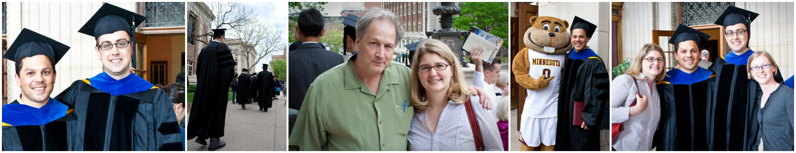
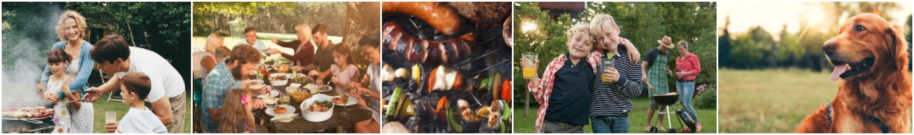
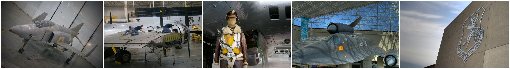
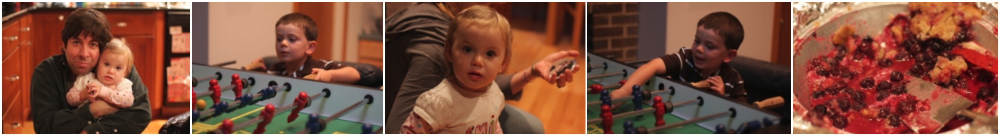

# Contextualize, Show and Tell  
  
This is the TensorFlow implementation of the Neural Visual Storyteller model described in the paper:  
  
*"Contextualize, Show and Tell: A Neural Visual Storyteller."*  
  
By Diana González-Rico and Gibrán Fuentes-Pineda.  
  
Storytelling Workshop, co-located with NAACL 2018.  
  
**Full text available at: [https://arxiv.org/abs/1806.00738](https://arxiv.org/abs/1806.00738)**
  
## Show and Tell  
  
This model extends Google's [_Show and Tell_](https://arxiv.org/abs/1609.06647) single image captioning model to a sequence to sequence model that generates a story from a sequence of 5 images. This extension relies on an encoder LSTM to compute a context vector from the image sequence. This context vector contains valuable information from the image sequence that is used by the LSTM decoders to generate the story.  
  
We used the code available in their Github [repository](https://github.com/tensorflow/models/tree/master/research/im2txt). Main changes have been made primarily to the model architecture within the ``show_and_tell_model.py`` file. Some other smaller changes were made to get along with the new architecture.  
  
## Architecture  
  
The _Context, Show and Tell_ model is a sequence to sequence model that consists of an LSTM encoder and multiple independent LSTM decoders. The following diagram illustrates the model architecture.  
  
  
  
**Encoder** (in yellow) At every timestep _t_ the encoder takes as input an image _Ii_ from the sequence. At time _t = 5_, the LSTM has encoded the complete image sequence and provides the context vector through its last hidden state denoted by **Z** .  
  
**Decoders** (in pink) The last hidden state from the encoder **Z** is used to initialize the first hidden state of every decoder. The first input to each decoder is the image representation _Ii_ for which the text is being generated.  
  
Each decoder generates a sequence of words _Si = \{p1, ..., pn\}_ for each image in the sequence. The final story is the concatenation of the output from all the decoders _S = \{S1, ..., S5\}_.  
  
As in *Show and Tell*, the image representation _e(Ii)_ is obtained via Inception V3 and the word embeddings were computed using word2vec.  
  
## Dependencies  
This code is written in Python. To use it you will need:  
* Python 2 and Python 3  
* Tensorflow 1.0  
* NumPy  
* Natural Language Toolkit (NLTK):  
	- First install NLTK ([instructions](http://www.nltk.org/install.html))  
	- Then install the NLTK data ([instructions](http://www.nltk.org/data.html))  
  
## Getting started  
  
### VIST dataset  
  
This model was trained using the Stories of Images-in-Sequence (SIS) from the [VIST](http://visionandlanguage.net/VIST/dataset.html) dataset. Mostly, each story from SIS is a 5 sentence text where each sentence corresponds to one of the 5 images in the sequence. You can download this dataset from the official site.  
  
Once downloaded, you should process each Json file (train, validation and test) and create Json files with the following structure:  
<pre><code>data_file =  
{  
"annotations" : [{'story_id': 30355, 'album_id': 72157605930515606, 'caption': 'Our landmark tree in town was about to be destroyed and cleared for a new mall.', 'image_id': 2627795780, 'order': 0, 'id':0},{ 'story_id': 30355, 'album_id': 72157605930515606, 'caption': 'So we decided to take the day to go out and enjoy its beauty.', 'image_id': 2626979987, 'order': 1, 'id':1}, {...}, ...],  
"images" : [{'width': 3648, 'date_captured': '2008-06-30 07:34:04', 'file_name': '2627795780.jpg', 'height': 2736, 'album_id': 72157605930515606, 'id': 2627795780}, {...}, ...]  
}  
</code></pre>  
  
Some of these attributes like height and width aren't provided in the original VIST Json files, however this data can be easily extracted from the images with a python script.  
  
### Training data  
To train the model you will have to provide training data in native TFRecord format. The TFRecord format consists of a set of sharded files containing serialized `tf.SequenceExample` protocol buffers.  
  
The `tf.SequenceExample` used for this project differ from the ones used in the _Show and Tell_ model. Here, each `tf.SequenceExample` proto contains the images from the sequence (JPEG or PNG format), the portion of the story for each image and metadata such as the images id, stories id, etc. This means that one of these `tf.SequenceExample` protos will contain the data from an entire sequence (5 images).  
  
These TFRecord files can be created using the `build_data.py` file provided in this project. This script works exactly like the one from [im2txt](https://github.com/tensorflow/models/tree/master/research/im2txt#prepare-the-training-data), the difference relies on the structure of the `tf.SequenceExample` protocol buffers.  
  
<pre><code> python2 build_data.py
</code></pre>  
  
To run this script, we recommend using Python 2 since we found some weird bugs when creating the TFRecords with Python 3. Remember to edit the first lines of this file (or pass them as parameters) to indicate the path to your Json files, your image directory and where to store the TFRecord files and the vocabulary file.  
  
### Inception v3 Checkpoint  
  
The _Show and Tell_ model requires a pretrained _Inception v3_ checkpoint file to initialize the parameters of its image encoder submodel.  
  
To obtain this checkpoint, you can follow the download instructions from the im2txt [repository](https://github.com/tensorflow/models/tree/master/research/im2txt#download-the-inception-v3-checkpoint).  
  
## Training  
  
Run the training script.  
  
<pre><code> python3 train.py --input_file_pattern="/path_to_sharded_files/train-?????-of-00122" --inception_checkpoint_file="/path_to_inception_checkpoint/inception_v3.ckpt" --train_dir="/path_to_save_checkpoints/train" --train_inception=false --number_of_steps=500000  
</pre></code>  
  
You can also run the evaluation script and a TensorBoard server in a separate process (see instructions [here](https://github.com/tensorflow/models/tree/master/research/im2txt#initial-training)) to monitor the training process in real-time.  
  
## Generating a story  
  
Once the model has finished training, you can generate stories from sequences of 5 images. The following command line will generate a story for a sequence of images from the VIST test set.  
  
<pre><code> python3 run_inference.py --checkpoint_path="/path_to_saved_checkpoints/train" --vocab_file="/path_to_vocab_file/word_counts.txt" --input_files="/path_to_images/3549359579.jpg","/path_to_images/3549346163.jpg","/path_to_images/3550171580.jpg","/path_to_images/3549370593.jpg","/path_to_images/3550167922.jpg"  
</pre></code>  
  
Example output:  
<pre><code>Captions for image 3549359579.jpg:  
0) today was graduation day . (p=0.004221)  
1) i was so excited to graduate today . (p=0.000571)  
2) the graduates were getting ready for the graduation . (p=0.000321)  
Captions for image 3549346163.jpg:  
0) the students were excited . (p=0.000713)  
1) he was so proud of his daughter . (p=0.000266)  
2) the students were excited to be there . (p=0.000179)  
Captions for image 3550171580.jpg:  
0) my parents were so happy . (p=0.000259)  
1) they were all very excited to see me . (p=0.000145)  
2) they were all very excited to be there . (p=0.000090)  
Captions for image 3549370593.jpg:  
0) he was very happy to be graduating . (p=0.000188)  
1) he was so happy to be graduating . (p=0.000164)  
2) he was very happy to be there . (p=0.000122)  
Captions for image 3550167922.jpg:  
0) everyone was so proud of him . (p=0.000143)  
1) everyone was so happy for the graduation . (p=0.000102)  
2) everyone was so happy for the graduation ! (p=0.000093)  
</pre></code>  
  
The image sequence:  

  
  
## Examples  
  
Below you can find some examples of the stories generated by the model.  
  
### Example 1  
#### Sequence of images  
 
#### Generated story  
  
_"We had a family get together. The family gathered around to eat and talk. The food was delicious. We had a great time. The dog is tired and ready to go."_  
  
### Example 2  
#### Sequence of images  

#### Generated story  
  
_"I went on a road trip last weekend. It was a long drive out of the city. I had a great time. There were a lot of cars that day. We had a great time and can’t wait to come back."_  
  
### Example 3  
#### Sequence of images  
 
#### Generated story  
  
_"The family got together for a party. They had a lot of fun. The little girl was having a great time. We had a lot of fun playing games. The cake was a success and everyone loved it."_  
  
**_NOTE_** : _Some of these sequences of images were taken from the VIST test set and others were created from internet images._  
  
## Visual Storytelling Challenge 2018  
  
This model participated on the first [Visual Storytelling Challenge](http://www.visionandlanguage.net/workshop2018/index.html#challenge) in which it obtained competitive results and was awarded 1st place in the competition.  
  
## Reference  
  
<pre><code> @article{DBLP:journals/corr/abs-1806-00738,  
author = {Diana Gonzalez{-}Rico and  
Gibran Fuentes Pineda},  
title = {Contextualize, Show and Tell: {A} Neural Visual Storyteller},  
journal = {CoRR},  
volume = {abs/1806.00738},  
year = {2018},  
url = {[http://arxiv.org/abs/1806.00738](http://arxiv.org/abs/1806.00738)},  
archivePrefix = {arXiv},  
eprint = {1806.00738},  
timestamp = {Mon, 13 Aug 2018 16:49:01 +0200},  
biburl = {[https://dblp.org/rec/bib/journals/corr/abs-1806-00738](https://dblp.org/rec/bib/journals/corr/abs-1806-00738)},  
bibsource = {dblp computer science bibliography, [https://dblp.org](https://dblp.org/)}  
}  
</pre></code>  
  
## Contact  
  
**Author:** Diana González-Rico (<[dianaglzrico@gmail.com](mailto:dianaglzrico@gmail.com)>)  
  
## Español  
  
Este trabajo fue realizado como parte de la tesis de maestría en el Posgrado en Ciencia e Ingeniería de la Computación del Instituto de Investigaciones en Matemáticas Aplicadas y en Sistemas de la Universidad Nacional Autónoma de México.  
  
Para un entendimiento más profundo del mismo (en español) refiérase a [aquí](http://oreon.dgbiblio.unam.mx/F/99S6GDKQUGJVBEBBF58QGRCD8C66B8T75BL8MITA8GTN2DHJI4-47000?func=find-b&request=diana+virginia+gonzalez+rico&find_code=WRD&adjacent=N&local_base=TES01&x=76&y=31&filter_code_2=WYR&filter_request_2=&filter_code_3=WYR&filter_request_3=).
